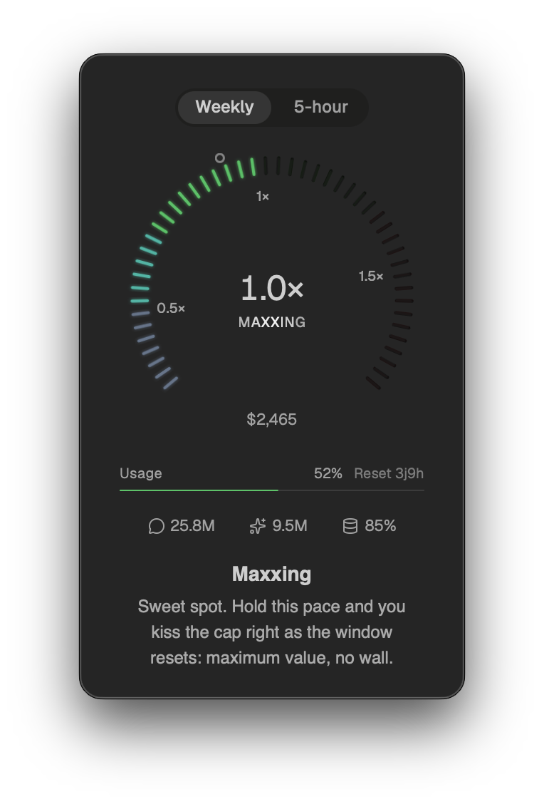
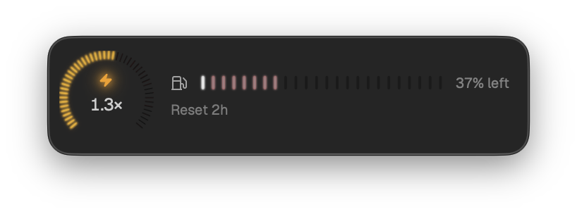
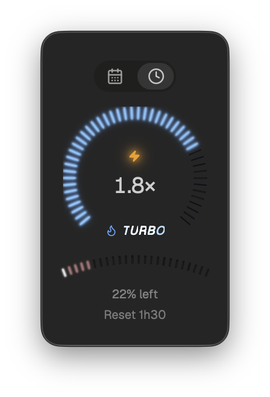
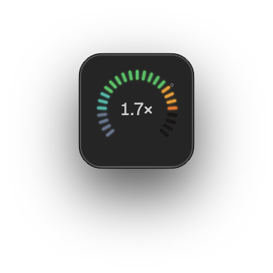

<div align="center">


# Minuit

**A speedometer for your Claude Code usage. Find your token-maxxing sweet spot at a glance.**

[](https://github.com/WeshGuillaume/minuit/releases)
[](https://github.com/WeshGuillaume/minuit/releases/latest)
[](LICENSE)
[](https://github.com/WeshGuillaume/minuit/releases/latest)

</div>

Minuit reads your real Claude Code usage and answers one question fast: at what
speed are you spending, compared to the speed that empties your cap right at
reset?

It shows a `pace` value instead of a level. `pace = your rate ÷ the sustainable
rate`, so `1.0×` is the sweet spot where you extract the most value without
slamming into the wall. Under `1.0×` you are underfarming, leaving compute you
paid for on the table. Over it you are redlining, and you will cap out before
the window resets.

You pay a flat monthly cap. Every hour spent below the sustainable rate is
capacity you bought and never touched. Every hour above it brings the wall
closer. Minuit draws that line and helps you ride it.

<div align="center">



</div>

## Features

- **Pace speedometer.** A live needle showing your burn rate against the rate
  that grazes the cap at reset. `1.0×` is the target.
- **Named zones.** `Underfarming`, `Coasting`, `Maxxing`, `Redlining`,
  `Way Too Fast`, `Capped`. Where you stand, no spreadsheet math.
- **Habit ghost.** A marker for where your habitual rhythm would land, so you
  can see when the current session deviates from your usual pace.
- **Raw usage bar.** The exact percentage that `/usage` reports, sitting under
  the dial as a reality anchor.
- **Two windows.** Flip between the weekly cap and the 5-hour rolling window.
- **Reactive.** Pace recomputes every 15 seconds off a local incremental scan
  of your Claude Code logs. The needle climbs the moment you sprint.
- **Fully local.** Reads your usage read-only from disk. No account, no
  telemetry, nothing leaves your machine.

<div align="center">



<em>Over the sustainable rate: you will slam the cap with hours still on the clock.</em>

</div>

<table>
<tr>
<td width="50%" align="center">
<br/>
<em>Compact window</em>
</td>
<td width="50%" align="center">
<br/>
<em>Mini dial, shrunk to a menubar glance</em>
</td>
</tr>
</table>

## Install

Grab the latest signed build from the
**[releases page](https://github.com/WeshGuillaume/minuit/releases/latest)**.

1. Download the `.dmg` for macOS.
2. Open it and drag **Minuit** into `Applications`.
3. Launch it. Minuit picks up your existing Claude Code usage automatically,
   with no sign-in and no setup.

Minuit ships with an over-the-air updater, so once installed it keeps itself
current.

Currently macOS only. The app is a lightweight [Tauri](https://tauri.app) build
(Rust plus web), so Windows and Linux support is feasible and contributions are
welcome.

## Install from source

**Prerequisites:** [Rust](https://rustup.rs), [Node.js](https://nodejs.org),
[pnpm](https://pnpm.io), and the
[Tauri system dependencies](https://tauri.app/start/prerequisites/) for your OS.

```bash
# 1. Clone
git clone https://github.com/WeshGuillaume/minuit.git
cd minuit/app

# 2. Install dependencies
pnpm install

# 3. Run in dev mode with hot reload
pnpm tauri dev

# 4. Or build a release bundle (.dmg / .app)
pnpm tauri build
```

The bundled app lands in `app/src-tauri/target/release/bundle/`.

### Handy scripts

| Command          | What it does                        |
| ---------------- | ----------------------------------- |
| `pnpm dev`       | Run the web frontend only (browser) |
| `pnpm tauri dev` | Run the full native app             |
| `pnpm build`     | Build the frontend                  |
| `pnpm typecheck` | TypeScript project check            |
| `pnpm test`      | Run the unit tests (Vitest)         |
| `pnpm lint`      | Lint and format check (Biome)       |

## Configuration

Everything user-editable lives in `~/.minuit/`. Minuit writes template files
there the first time it runs (with `config.json` pre-filled with defaults),
so you can just edit them — no schema to look up. Two files matter:

- **`config.json`** — window behavior + a few frontend prefs. Applied at
  launch; **no live reload**, restart the app after editing.
- **`pricing.json`** — API rates, subscription prices, and pace-zone cut
  points. Not auto-written; create it yourself to override any field (a
  shallow merge on top of the built-in defaults — nested objects like
  `models` or `pace.thresholds` are replaced wholesale if present, not
  deep-merged).

### `config.json`

```json
{
  "width": 80,
  "height": 80,
  "trafficLights": false,
  "alwaysOnTop": true,
  "closeOnEsc": false,
  "closeOnClickOutside": false,
  "appearShortcut": "Cmd+Shift+8",
  "showInDock": false,
  "work": { "hoursPerDay": 8 },
  "display": { "paceAxis": "broken" },
  "pace": {
    "readoutMinutes": { "five_hour": 2, "seven_day": 20 },
    "smoothMinutes": { "five_hour": 30, "seven_day": 240 }
  }
}
```

| Field                        | Default        | What it does                                                                                                                      |
| ----------------------------- | -------------- | ----------------------------------------------------------------------------------------------------------------------------------- |
| `width` / `height`           | `330` / `467`  | Logical window size at launch. Small values give you the mini dial.                                                                  |
| `trafficLights`               | `true`          | Show the macOS red/yellow/green window buttons.                                                                                       |
| `alwaysOnTop`                  | `false`         | Keep the window floating above other windows.                                                                                          |
| `closeOnEsc`                   | `true`          | Hide the window when you press Escape.                                                                                                  |
| `closeOnClickOutside`          | `false`         | Hide the window when it loses focus.                                                                                                     |
| `appearShortcut`               | unset           | Global hotkey that toggles the window, for example `Cmd+Shift+8`. Omit to unbind.                                                        |
| `showInDock`                   | `true`          | Show Minuit in the Dock and Cmd+Tab switcher. Set to `false` for a background app.                                                       |
| `work.hoursPerDay`             | `24`            | Hours per day you actually work, `0 < h ≤ 24`. Anchors the sustainable rate to your real working hours instead of the wall clock; 24 spreads it round-the-clock. |
| `display.paceAxis`             | `"broken"`      | Pace dial scale: `"broken"` (fixed track, maxxing reads big and central) or `"linear"` (true-proportion axis).                          |
| `pace.readoutMinutes`          | `{5h: 2, 7d: 20}` | How far back the **live** needle looks, in minutes, per rate-limit window. Shorter = nervier. Accepts a single number (applies to both windows) or `{ five_hour, seven_day }`. Clamped `0 < m ≤ 240`. |
| `pace.smoothMinutes`           | `{5h: 30, 7d: 240}` | How far back the **smooth** pace looks, in minutes, per window — the steady recent rhythm that doesn't flatline between prompts. Same scalar-or-object shape. Clamped `0 < m ≤ 1440`. |

The example above is a menubar-style setup: a tiny always-on-top dial, no
Dock icon, no traffic lights, summoned with `Cmd+Shift+8`, tuned to an 8-hour
workday.

> `display.tokenAxis` also exists on disk (defaults to `"linear"`) but isn't
> wired to anything in the current UI yet — safe to ignore.

### `pricing.json`

Not written automatically — create `~/.minuit/pricing.json` to override any
subset of these fields. Edit this when Anthropic changes plan prices or API
rates.

```json
{
  "activePlan": "max5x",
  "subscriptions": { "pro": 20, "max5x": 100, "max20x": 200 }
}
```

| Field                                  | Default                                              | What it does                                                                 |
| ---------------------------------------- | ------------------------------------------------------ | ------------------------------------------------------------------------------- |
| `updated`                                | `"2026-07-15"`                                          | Informational date stamp for when the rates below were last verified.           |
| `models.<family>.input`                  | opus 15 · sonnet 3 · haiku 0.8 · fable 15               | Input token rate, USD per million tokens.                                       |
| `models.<family>.output`                 | opus 75 · sonnet 15 · haiku 4 · fable 75                | Output token rate, USD per million tokens.                                      |
| `models.<family>.cacheRead`              | opus 1.5 · sonnet 0.3 · haiku 0.08 · fable 1.5          | Cache-read rate, USD per million tokens.                                        |
| `models.<family>.cacheWrite5m`           | opus 18.75 · sonnet 3.75 · haiku 1 · fable 18.75        | 5-minute ephemeral cache-write rate, USD per million tokens.                    |
| `models.<family>.cacheWrite1h`           | opus 30 · sonnet 6 · haiku 1.6 · fable 30               | 1-hour ephemeral cache-write rate, USD per million tokens.                      |
| `match`                                  | opus/sonnet/haiku/fable → themselves                    | Maps a substring of a model id (e.g. `claude-opus-4-8`) to a pricing family.     |
| `subscriptions`                          | `{ pro: 20, max5x: 100, max20x: 200 }`                  | Monthly plan prices, USD.                                                       |
| `activePlan`                             | `"max20x"`                                              | Which `subscriptions` key is currently active.                                  |
| `subscriptionPeriodDays`                 | `30.44`                                                 | Average month length used to prorate the subscription cost.                     |
| `ratioThresholds.underuse`               | `0.5`                                                   | Profitability-ratio badge verdict bound.                                        |
| `ratioThresholds.breakEven`              | `1.1`                                                   | Ratio below which Anthropic would be running your usage at a loss (badge hover).|
| `projection.lookbackWeeks`               | `4`                                                      | Calibration horizon for `dollarsPerPct` (recent-window $-to-% anchoring).       |
| `pace.thresholds.coasting`               | `0.5`                                                    | Pace at which the Coasting zone opens.                                          |
| `pace.thresholds.maxxing`                | `0.85`                                                   | Pace at which the Maxxing (sweet spot) zone opens.                              |
| `pace.thresholds.redlining`              | `1.15`                                                   | Pace at which the Redlining zone opens.                                         |
| `pace.thresholds.turbo`                  | `1.5`                                                    | Pace at which the Turbo zone opens.                                             |
| `pace.thresholds.nitro`                  | `2`                                                       | Pace at which the Nitro zone opens.                                             |

⚠️ `fable`'s rates are a placeholder cloned from `opus` — update them once
Anthropic publishes real pricing for that tier.

### Other files in `~/.minuit/`

These are internal caches, not meant to be hand-edited:

| File                        | Purpose                                                                 |
| ------------------------------ | ---------------------------------------------------------------------- |
| `scan-cache.json`              | Incremental JSONL scan cache, keyed by file mtime + size.               |
| `usage-cache.json`             | TTL'd cache of the last `/api/oauth/usage` response (~3min).            |
| `credentials-backup.json`      | One-time snapshot of your OAuth credentials, taken before any refresh.  |
| `refresh.lock`                 | Lock file guarding the OAuth token refresh against a race with `claude`.|

## Contributing

Issues and PRs are welcome, especially Windows and Linux support. The codebase
is strictly typed, split into small files, and test-covered. See
[`CLAUDE.md`](CLAUDE.md) for the architecture and conventions.

## License

[GPL-3.0](LICENSE) © Guillaume Badi
